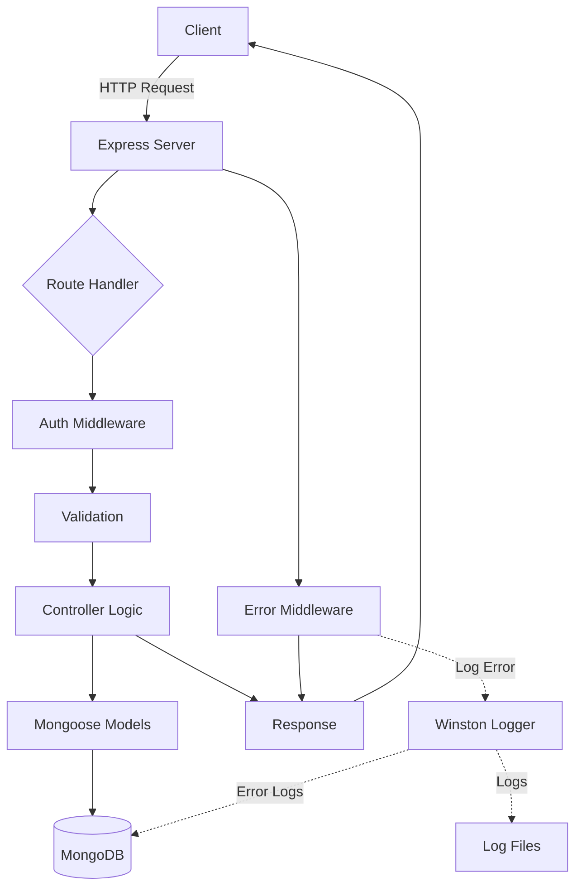
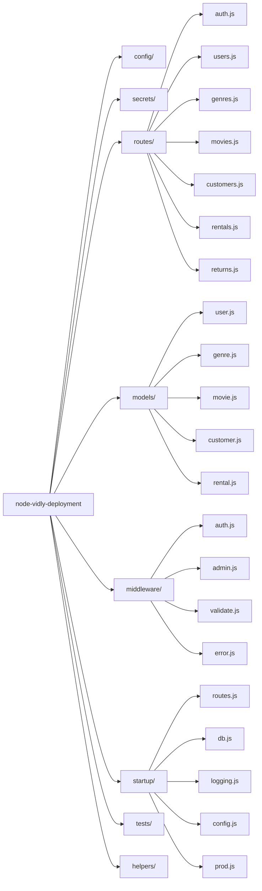

# Node Vidly Deployment

Vidly is a production-ready RESTful API built with Node.js for managing a complete movie rental service backend.

Built in July 2018, it provides secure JWT-based authentication, role-based authorization, movie catalog management, customer tracking, and rental processing with transactional integrity. Powered by MongoDB and Mongoose, the application includes robust security via Helmet and bcrypt, comprehensive logging with Winston, automated unit and integration testing using Jest, and a scalable Express architecture designed for real-world deployment and maintainability.

## Core Capabilities

- \*\*User authentication and authorization with JWT
- \*\*Movie catalog management with genre classification
- \*\*Customer management with loyalty program (Gold members)
- \*\*Rental operations with transactional integrity
- \*\*MongoDB persistence with Mongoose ODM
- \*\*Security features (Helmet, bcrypt password hashing)
- \*\*Comprehensive logging (Winston)
- \*\*Unit and integration testing with Jest
- \*\*Production-ready with compression

## Technical Excellence

- **Modular Architecture**: Separation of concerns with routes, models, middleware, and startup configuration
- **Validation Layer**: Comprehensive input validation and sanitization
- **Error Handling**: Centralized error handling and logging
- **Testing Strategy**: Unit tests for individual components and integration tests for API endpoints
- **Security First**: Implements security best practices from the ground up

## Developer Experience

- **Clear Structure**: Well-organized directory structure for easy navigation
- **Comprehensive Documentation**: Detailed API documentation and setup guides
- **Testing Support**: Pre-configured test environment with Jest
- **Code Quality**: ESLint and Prettier for consistent code style
- **Configuration Management**: Environment-specific configuration files

## Features

- 🔐 User authentication and authorization with JWT
- 🎬 Movie catalog management with genre classification
- 👥 Customer management with loyalty program (Gold members)
- 📦 Rental operations with transactional integrity
- 💾 MongoDB persistence with Mongoose ODM
- 🔒 Security features (Helmet, bcrypt password hashing)
- 📊 Comprehensive logging (Winston)
- ✅ Unit and integration testing with Jest
- 🚀 Production-ready with compression

## Getting Started

### Prerequisites

- Node.js (v8.11.3 or higher)
- MongoDB (local or Atlas)
- npm or yarn

## Configuration

### Environment Variables

Set the following environment variable:

```bash
export NODE_ENV=development
```

Available environments:

- `development` (default)
- `test`
- `production`

### Configuration Files

Edit the configuration files in `config/`:

- `config.development.json` - Development settings
- `config.test.json` - Test environment settings
- `config.production.json` - Production settings

### Secrets Files

Edit the secrets files in `secrets/`:

- `secrets.development.json` - Development secrets (JWT key, DB connection)
- `secrets.test.json` - Test secrets
- `secrets.production.json` - Production secrets

**Important**: Never commit actual secret values to version control.

### Installation

1. Clone the repository:

```bash
git clone https://github.com/orassayag/node-vidly-deployment.git
cd node-vidly-deployment
```

2. Install dependencies:

```bash
npm install
```

3. Set up MongoDB:
   - Install MongoDB locally or create a MongoDB Atlas account
   - Update the connection string in `config/config.development.json`

4. Configure secrets:
   - Edit `secrets/secrets.development.json`
   - Set your JWT secret key

5. Set environment (optional):

```bash
export NODE_ENV=development
```

### Running the Application

Start the server:

```bash
npm start
```

The API will be available at `http://localhost:3000`

### Running Tests

Run all tests:

```bash
npm test
```

## Available Scripts

In the project directory, you can run:

### `npm start`

Runs the app in the development mode.
Open [http://localhost:3000](http://localhost:3000) to view it in your browser.

### `npm test`

Launches the test runner in the interactive watch mode.

## Development

### Code Quality

**Lint code:**

```bash
npm run lint
```

### Testing

**Run all tests:**

```bash
npm test
```

## Architecture Principles

This project follows clean architecture principles:

1. **Separation of Concerns**: Code is organized into distinct layers (routes, models, middleware, startup)
2. **Middleware Pipeline**: Uses Express middleware for cross-cutting concerns (authentication, validation, error handling)
3. **Configuration Management**: Environment-specific configuration files for different deployment scenarios
4. **Error Handling**: Centralized error handling middleware for consistent error responses
5. **Testability**: Modular design enables easy unit and integration testing

## Design Patterns

- **Middleware Pattern**: Cross-cutting concerns (auth, validation) are handled via middleware
- **Repository Pattern**: Mongoose models abstract database operations
- **Factory Pattern**: Startup modules initialize application components
- **Observer Pattern**: Winston logger for event tracking and logging

## Directory Structure

```
node-vidly-deployment/
├── config/              # Configuration files
│   ├── config.development.json
│   ├── config.production.json
│   └── config.test.json
├── helpers/             # Utility functions and validations
│   └── validations.js
├── middleware/          # Express middleware
│   ├── admin.js
│   ├── auth.js
│   ├── error.js
│   ├── validate.js
│   └── validateObjectId.js
├── models/              # Mongoose models
│   ├── customer.js
│   ├── genre.js
│   ├── movie.js
│   ├── rental.js
│   └── user.js
├── routes/              # API route handlers
│   ├── auth.js
│   ├── customers.js
│   ├── genres.js
│   ├── movies.js
│   ├── rentals.js
│   ├── returns.js
│   └── users.js
├── secrets/             # Secret configuration (not committed)
│   ├── secrets.development.json
│   ├── secrets.production.json
│   └── secrets.test.json
├── startup/             # Application initialization modules
│   ├── config.js
│   ├── db.js
│   ├── logging.js
│   ├── prod.js
│   └── routes.js
├── tests/               # Test files
│   ├── integration/
│   └── unit/
│       ├── middleware/
│       └── models/
├── .eslintrc.js
├── .gitignore
├── .prettierrc
├── CHANGELOG.md
├── CODE_OF_CONDUCT.md
├── CONTRIBUTING.md
├── INSTRUCTIONS.md
├── LICENSE
├── README.md
├── SECURITY.md
├── index.js
├── package-lock.json
└── package.json
```

## Best Practices

### Development Workflow

1. **Environment Setup**: Always configure the appropriate environment (development/test/production)
2. **Secrets Management**: Never commit secret files to version control
3. **Testing**: Write tests for new features and bug fixes
4. **Code Quality**: Run ESLint and Prettier before committing changes

### Security Best Practices

1. **Password Hashing**: Always use bcrypt for password storage
2. **JWT Security**: Use strong secret keys and appropriate token expiration
3. **Input Validation**: Validate and sanitize all user input
4. **Role-Based Access Control**: Use admin middleware for protected routes
5. **Helmet Security**: Helmet middleware is enabled for production

### Deployment Best Practices

1. **Environment Variables**: Use appropriate NODE_ENV setting
2. **Logging**: Monitor logs for errors and security issues
3. **Compression**: Compression middleware is enabled in production
4. **Database Security**: Use secure MongoDB connection strings

## Usage

### API Endpoints

#### Authentication

- `POST /api/auth` - Login and receive JWT token

#### Users

- `POST /api/users` - Register a new user
- `GET /api/users/me` - Get current user info (protected)

#### Genres

- `GET /api/genres` - Get all genres
- `POST /api/genres` - Create a genre (protected)
- `PUT /api/genres/:id` - Update a genre (protected)
- `DELETE /api/genres/:id` - Delete a genre (admin only)
- `GET /api/genres/:id` - Get a specific genre

#### Movies

- `GET /api/movies` - Get all movies
- `POST /api/movies` - Create a movie (protected)
- `PUT /api/movies/:id` - Update a movie (protected)
- `DELETE /api/movies/:id` - Delete a movie (protected)
- `GET /api/movies/:id` - Get a specific movie

#### Customers

- `GET /api/customers` - Get all customers
- `POST /api/customers` - Create a customer (protected)
- `PUT /api/customers/:id` - Update a customer (protected)
- `DELETE /api/customers/:id` - Delete a customer (protected)
- `GET /api/customers/:id` - Get a specific customer

#### Rentals

- `GET /api/rentals` - Get all rentals
- `POST /api/rentals` - Create a rental (protected)

#### Returns

- `POST /api/returns` - Process a movie return (protected)

**Note**: Protected routes require `x-auth-token` header with valid JWT.

## Support

For questions, issues, or contributions:

- **GitHub Issues**: [https://github.com/orassayag/node-vidly-deployment/issues](https://github.com/orassayag/node-vidly-deployment/issues)
- **Email**: orassayag@gmail.com

## API Documentation

### Authentication

- `POST /api/auth` - Login and receive JWT token

### Users

- `POST /api/users` - Register a new user
- `GET /api/users/me` - Get current user info (protected)

### Genres

- `GET /api/genres` - Get all genres
- `POST /api/genres` - Create a genre (protected)
- `PUT /api/genres/:id` - Update a genre (protected)
- `DELETE /api/genres/:id` - Delete a genre (admin only)
- `GET /api/genres/:id` - Get a specific genre

### Movies

- `GET /api/movies` - Get all movies
- `POST /api/movies` - Create a movie (protected)
- `PUT /api/movies/:id` - Update a movie (protected)
- `DELETE /api/movies/:id` - Delete a movie (protected)
- `GET /api/movies/:id` - Get a specific movie

### Customers

- `GET /api/customers` - Get all customers
- `POST /api/customers` - Create a customer (protected)
- `PUT /api/customers/:id` - Update a customer (protected)
- `DELETE /api/customers/:id` - Delete a customer (protected)
- `GET /api/customers/:id` - Get a specific customer

### Rentals

- `GET /api/rentals` - Get all rentals
- `POST /api/rentals` - Create a rental (protected)

### Returns

- `POST /api/returns` - Process a movie return (protected)

**Note:** Protected routes require `x-auth-token` header with valid JWT.

## Architecture



## Project Structure



## Built With

- [Node.js](https://nodejs.org/en) - JavaScript runtime
- [Express](https://expressjs.com) - Web framework
- [MongoDB](https://www.mongodb.com) - NoSQL database
- [Mongoose](https://mongoosejs.com) - MongoDB ODM
- [JWT](https://jwt.io) - JSON Web Tokens for authentication
- [bcrypt](https://www.npmjs.com/package/bcrypt) - Password hashing
- [Winston](https://github.com/winstonjs/winston) - Logging library
- [Jest](https://jestjs.io) - Testing framework
- [Helmet](https://helmetjs.github.io) - Security middleware
- [Fawn](https://www.npmjs.com/package/fawn) - Transactional operations

## Security

This application implements multiple security best practices:

- Password hashing with bcrypt (10 salt rounds)
- JWT token-based authentication with expiration
- HTTP security headers via Helmet
- Input validation on all endpoints
- Role-based access control (admin middleware)
- MongoDB ObjectId validation
- Secure error messages (no sensitive data exposure)

## Testing

The project includes comprehensive testing:

- **Unit Tests**: Test individual functions and methods in isolation
- **Integration Tests**: Test API endpoints and database operations

Tests are located in:

- `tests/unit/` - Unit tests
- `tests/integration/` - Integration tests

## Contributing

Contributions to this project are [released](https://help.github.com/articles/github-terms-of-service/#6-contributions-under-repository-license) to the public under the [project's open source license](LICENSE).

Everyone is welcome to contribute. Contributing doesn't just mean submitting pull requests—there are many different ways to get involved, including answering questions and reporting issues.

Please read [CONTRIBUTING.md](CONTRIBUTING.md) for details on the code of conduct and the process for submitting pull requests.

## Author

- **Or Assayag** - _Initial work_ - [orassayag](https://github.com/orassayag)
- Or Assayag <orassayag@gmail.com>
- GitHub: https://github.com/orassayag
- StackOverflow: https://stackoverflow.com/users/4442606/or-assayag?tab=profile
- LinkedIn: https://linkedin.com/in/orassayag

## License

This application has an MIT license - see the [LICENSE](LICENSE) file for details.

## Acknowledgments

- Built for educational and research purposes
- Respects robots.txt and implements rate limiting
- Uses user-agent rotation to avoid detection
- Implements polite crawling practices
