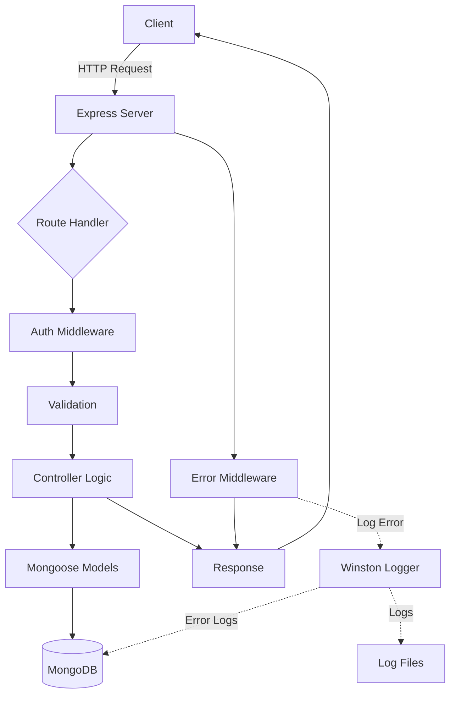
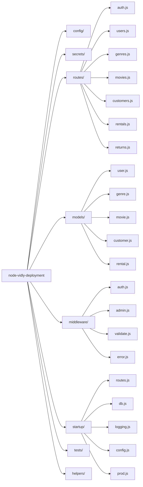

# Vidly - Movie Rental REST API

A production-ready RESTful API built with Node.js for managing a movie rental service. Features user authentication, movie catalog management, customer tracking, and rental operations with MongoDB persistence.

Built in July 2018. This Node.js application provides a complete backend solution for a video rental business, including JWT authentication, role-based access control, transactional rentals, and comprehensive logging.

## Features

- 🔐 User authentication and authorization with JWT
- 🎬 Movie catalog management with genre classification
- 👥 Customer management with loyalty program (Gold members)
- 📦 Rental operations with transactional integrity
- 💾 MongoDB persistence with Mongoose ODM
- 🔒 Security features (Helmet, bcrypt password hashing)
- 📊 Comprehensive logging (Winston)
- ✅ Unit and integration testing with Jest
- 🚀 Production-ready with compression

## Getting Started

### Prerequisites

- Node.js (v8.11.3 or higher)
- MongoDB (local or Atlas)
- npm or yarn

### Installation

1. Clone the repository:
```bash
git clone https://github.com/orassayag/node-vidly-deployment.git
cd node-vidly-deployment
```

2. Install dependencies:
```bash
npm install
```

3. Set up MongoDB:
   - Install MongoDB locally or create a MongoDB Atlas account
   - Update the connection string in `config/config.development.json`

4. Configure secrets:
   - Edit `secrets/secrets.development.json`
   - Set your JWT secret key

5. Set environment (optional):
```bash
export NODE_ENV=development
```

### Running the Application

Start the server:
```bash
npm start
```

The API will be available at `http://localhost:3000`

### Running Tests

Run all tests:
```bash
npm test
```

## API Documentation

### Authentication
- `POST /api/auth` - Login and receive JWT token

### Users
- `POST /api/users` - Register a new user
- `GET /api/users/me` - Get current user info (protected)

### Genres
- `GET /api/genres` - Get all genres
- `POST /api/genres` - Create a genre (protected)
- `PUT /api/genres/:id` - Update a genre (protected)
- `DELETE /api/genres/:id` - Delete a genre (admin only)
- `GET /api/genres/:id` - Get a specific genre

### Movies
- `GET /api/movies` - Get all movies
- `POST /api/movies` - Create a movie (protected)
- `PUT /api/movies/:id` - Update a movie (protected)
- `DELETE /api/movies/:id` - Delete a movie (protected)
- `GET /api/movies/:id` - Get a specific movie

### Customers
- `GET /api/customers` - Get all customers
- `POST /api/customers` - Create a customer (protected)
- `PUT /api/customers/:id` - Update a customer (protected)
- `DELETE /api/customers/:id` - Delete a customer (protected)
- `GET /api/customers/:id` - Get a specific customer

### Rentals
- `GET /api/rentals` - Get all rentals
- `POST /api/rentals` - Create a rental (protected)

### Returns
- `POST /api/returns` - Process a movie return (protected)

**Note:** Protected routes require `x-auth-token` header with valid JWT.

## Architecture



## Project Structure



## Built With

* [Node.js](https://nodejs.org/en) - JavaScript runtime
* [Express](https://expressjs.com) - Web framework
* [MongoDB](https://www.mongodb.com) - NoSQL database
* [Mongoose](https://mongoosejs.com) - MongoDB ODM
* [JWT](https://jwt.io) - JSON Web Tokens for authentication
* [bcrypt](https://www.npmjs.com/package/bcrypt) - Password hashing
* [Winston](https://github.com/winstonjs/winston) - Logging library
* [Jest](https://jestjs.io) - Testing framework
* [Helmet](https://helmetjs.github.io) - Security middleware
* [Fawn](https://www.npmjs.com/package/fawn) - Transactional operations

## Security

This application implements multiple security best practices:
- Password hashing with bcrypt (10 salt rounds)
- JWT token-based authentication with expiration
- HTTP security headers via Helmet
- Input validation on all endpoints
- Role-based access control (admin middleware)
- MongoDB ObjectId validation
- Secure error messages (no sensitive data exposure)

## Testing

The project includes comprehensive testing:
- **Unit Tests**: Test individual functions and methods in isolation
- **Integration Tests**: Test API endpoints and database operations

Tests are located in:
- `tests/unit/` - Unit tests
- `tests/integration/` - Integration tests

## Contributing

Contributions to this project are [released](https://help.github.com/articles/github-terms-of-service/#6-contributions-under-repository-license) to the public under the [project's open source license](LICENSE).

Everyone is welcome to contribute. Contributing doesn't just mean submitting pull requests—there are many different ways to get involved, including answering questions and reporting issues.

Please read [CONTRIBUTING.md](CONTRIBUTING.md) for details on the code of conduct and the process for submitting pull requests.

## Author

* **Or Assayag** - *Initial work* - [orassayag](https://github.com/orassayag)
* Or Assayag <orassayag@gmail.com>
* GitHub: https://github.com/orassayag
* StackOverflow: https://stackoverflow.com/users/4442606/or-assayag?tab=profile
* LinkedIn: https://linkedin.com/in/orassayag

## License

This application has an MIT license - see the [LICENSE](LICENSE) file for details.
